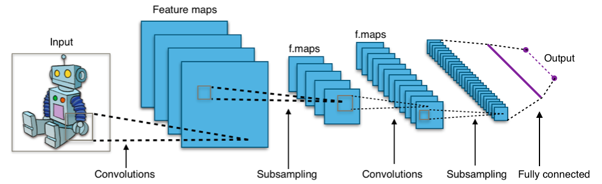

# ML & Java
This repo contains demos for my talk `ML & Java`. It focuses on using/comparing 3 ML frameworks and JSR-381. 

The structure of `src/main` directory is as follows:
```shell
|-- java                  
|   `-- org        
|       `-- example
|           |-- dl4j      # Deeplearning4j training + testing examples
|           `-- visrec    # JSR-381 training + testing examples
`-- resources
    |-- dataset
    |   |-- test          # Test dataset
    |   |   |-- hotdog
    |   |   `-- nothotdog
    |   `-- train         # Training dataset
    |       |-- hotdog
    |       `-- nothotdog
    `-- visrec            # JSR-381 config files
```
#### Dataset
I am using this [dataset](https://www.kaggle.com/datasets/yashvrdnjain/hotdognothotdog) for both demos
#### DJL serving
Start the container 
```shell
docker run -itd -p 8080:8080 deepjavalibrary/djl-serving
```
head to `http://localhost:8080` and load `resnet18` Pytorch model from `https://resources.djl.ai/demo/pytorch/traced_resnet18.zip`.

#### CNN
Instead of feeding entire images into the neural network as one grid of numbers, we’re going to do something a lot smarter that takes advantage of the idea that an object is the same no matter where it appears in a picture.

1. Splitting image into overlapping image tiles
2. Feeding each tile into a small neural network
3. If something interesting appears in any tile, we mark it. Note that we keep the same neural network weights for every single tile in the same original image.
4. Save the results from each tile into a new array
5. For each image, we end up with an array that maps out which parts of the original image are the most interesting.(convolution)
6. Next, we run sub-sampling strategy, which help us to reduce image array, by keeping the most interesting bits. (max-pooling)
7. We feed our smaller array from the previous as input into another neural network.
8. Decide if it's a match or not. (fully-connected network)
Of course this is an over-simplified version of CNN. to solve real world problems, these steps can be combined and stacked as many times as we want! we can use two, three or even ten convolution layers. We can throw in max-pooling wherever we want to reduce the size of your data.